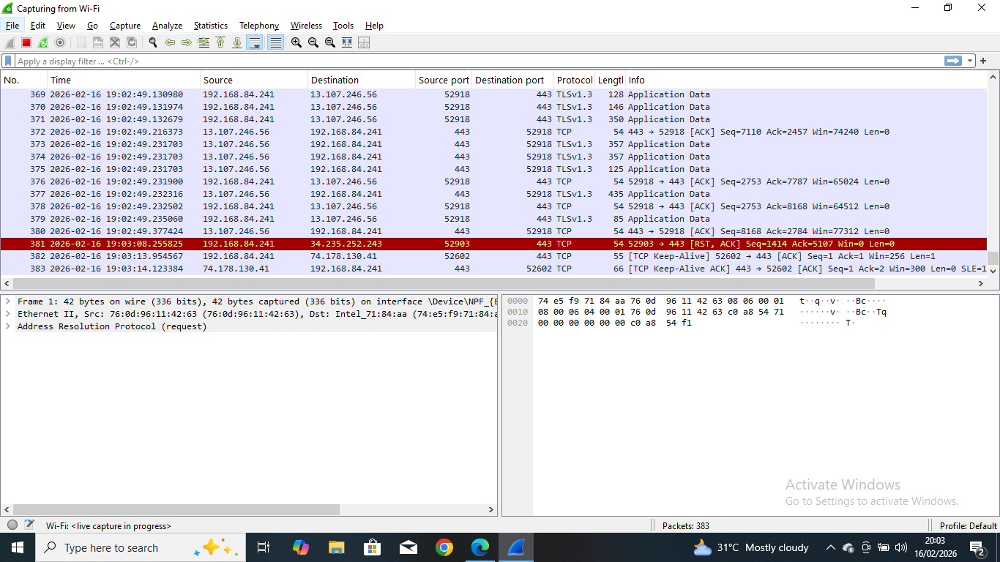
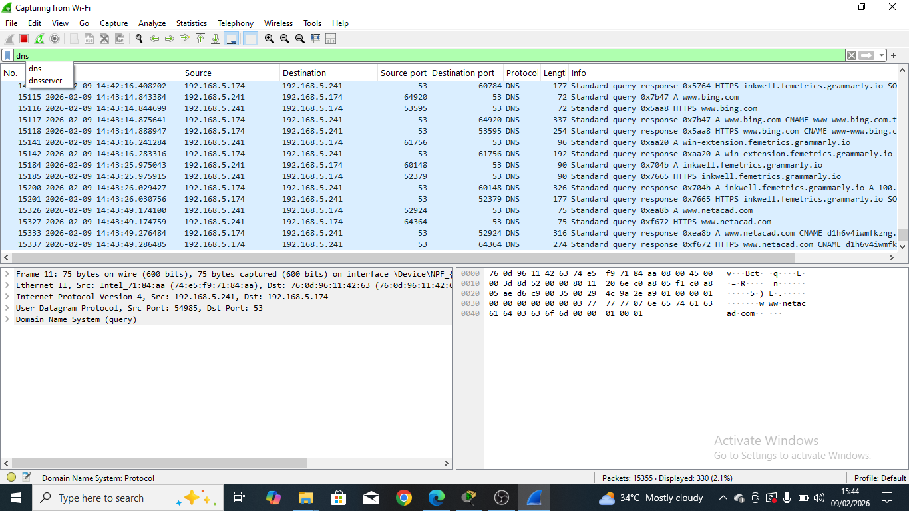
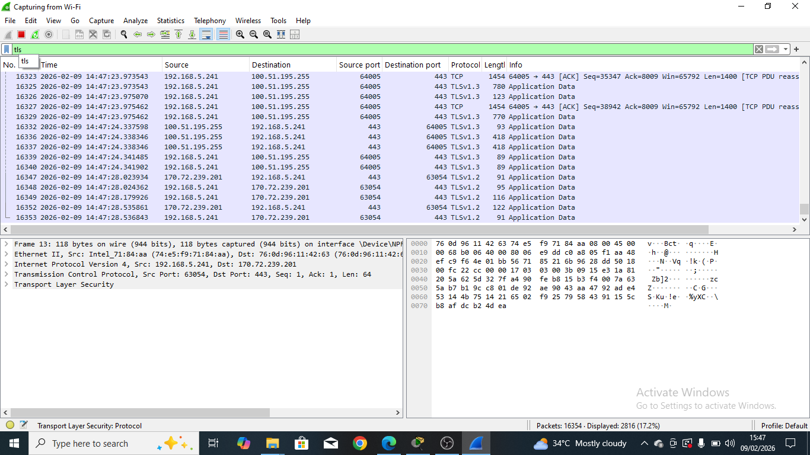

# Wireshark-Network-Traffic-Analysis-Project.

SOC Analyst project analyzing live network traffic using Wireshark to detect unencrypted communication and security risks.

## Project Overview.
This project demonstrates practical application of network traffic analysis using Wireshark. The objective was to capture and analyse live network traffic to identify normal and suspicious traffic patterns, security risks such as unencrypted communication and observable DNS activities.

## Objectives.
To analyze captured network packets and identify:
- Protocols in use.
- Network conversations.
- Potential security risks.
- Unencrypted communications.

## Project Problem Statement.
Many users assume all internet traffic is secure. However, some communication still occurs without encryption, which may expose sensitive information to attackers monitoring network traffic.

## Tools Used
- Wireshark.
- Windows OS.
- Wi-Fi Network Connection.
- Web Browser.
- Sample network traffic capture

## Methodology
- I captured live traffic using Wireshark.
- Selected active Wi-Fi network interface.
- Generated traffic by browsing websites.
- Applied protocol filter:

## Live Traffic
### This screenshot shows Live Traffic capture.

  DNS
### This capture shows DNS queries captured during live traffic monitoring.

  TLS
### This screenshot demonstrates encrypted HTTPS communication using TLS protocol.

## Analysis performed
- Live traffic capture
- Protocol filtering (HTTP, DNS, TLS)
- Packet inspection
- Identification of plaintext traffic

### DNS Traffic Analysis
DNS packets revealed domain resolution requests showing how systems translate domain names into IP addresses.

### TLS Traffic Analysis
TLS packets confirm encrypted communication and protect transmitted data.

### Live Traffic Observation
I observed data transmission without encryption, demonstrating potential exposure risks.

## Key Findings
- Observed DNS queries and responses.
- Identified HTTP traffic transmitting data in plaintext
- Live traffic is vulnerable to interception.
- HTTPS encrypts communication and improves security posture.

## Security Recommendations
- Enforce HTTPS-only communiction.
- Monitor DNS activities for suspicious domains.
- Implement continuous network monitoring.

## Skills Demonstrated
- Packet capture and analysis
- Traffic filtering
- Network protocol identification
- Cybersecurity investigation basics
- Security risk identification
- SOC analyst fundamentals

## What I learned
This project strengthened my understanding of how network traffic flows and how attackers or suspicious activitiy may appear inside packet captures.

## Author
Igbojionu Linda
- SOC Analyst | Network Administrator | Aspiring Network Security Engineer.

